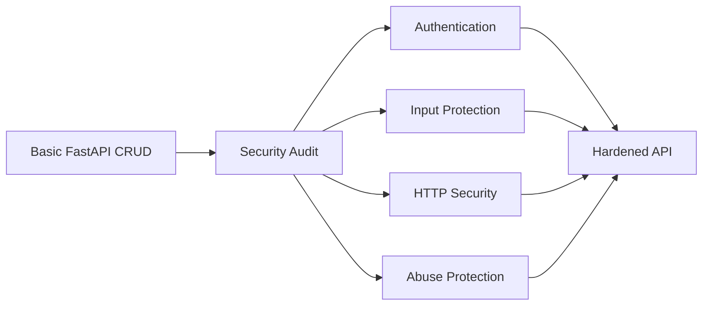
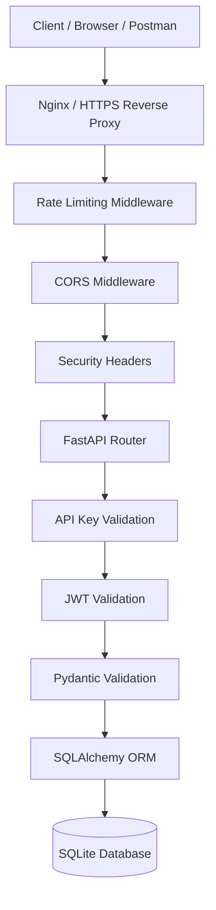
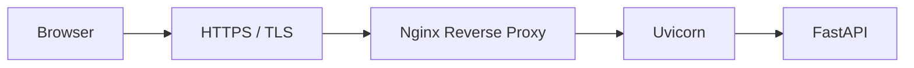

# 🔐 API Security Audit

> A production-inspired FastAPI Employee CRUD API hardened with layered security controls including API key authentication, JWT authentication, rate limiting, CORS, secure headers, input validation, SQL injection prevention, XSS input protection, environment-based configuration, and HTTPS-ready deployment support.


---

## 📌 Table of Contents

- [🔎 Overview](#-overview)
- [🎯 Objective](#-objective)
- [🏗️ Architecture](#️-architecture)
- [🔐 Security Architecture](#-security-architecture)
- [🛠️ Technology Stack](#️-technology-stack)
- [📁 Project Structure](#-project-structure)
- [✨ Security Features](#-security-features)
- [⚙️ Setup & Installation](#️-setup--installation)
- [🔑 Environment Variables](#-environment-variables)
- [🚀 Running the Application](#-running-the-application)
- [🔌 API Endpoints](#-api-endpoints)
- [🧪 Security Testing](#-security-testing)
- [🚦 Rate Limiting Demo](#-rate-limiting-demo)
- [🌐 CORS Demo](#-cors-demo)
- [🛡️ Security Headers](#️-security-headers)
- [🔒 HTTPS-Ready Configuration](#-https-ready-configuration)
- [🎥 YouTube Demonstration](#-youtube-demonstration)
- [🧩 Troubleshooting](#-troubleshooting)
- [📌 Assignment Coverage](#-assignment-coverage)
- [🔮 Future Improvements](#-future-improvements)
- [🧠 Key Engineering Lessons](#-key-engineering-lessons)
- [👨‍💻 Author](#-author)

---

## 🔎 Overview

The **API Security Audit** project starts with a small Employee CRUD REST API and progressively hardens it against common API security risks.

The project demonstrates an important engineering workflow:



The goal is not simply to add security libraries. Each security control is implemented and tested against a concrete requirement.

---

## 🎯 Objective

### Core Requirements

- API Key Authentication
- JWT Authentication
- HTTPS-ready configuration
- Rate Limiting
- CORS
- Secure HTTP Headers
- Input Validation
- SQL Injection Prevention
- XSS Prevention
- Environment Variables
- Secret Management

### Bonus

- Redis-backed Rate Limiting

### Demonstration

The security audit includes **before-and-after attack demonstrations** showing how requests behave before and after the corresponding security controls are applied.

---

## 🏗️ Architecture



### Request Security Flow

```text
Client Request
      │
      ▼
Rate Limiting
      │
      ▼
CORS / HTTP Security
      │
      ▼
API Key Authentication
      │
      ▼
JWT Authentication
      │
      ▼
Pydantic Input Validation
      │
      ▼
SQLAlchemy ORM
      │
      ▼
Database
```

---

## 🔐 Security Architecture

### Two-Layer Authentication

Protected employee endpoints currently require both:

```text
X-API-Key
      +
Authorization: Bearer <JWT>
      ↓
Protected Endpoint
```

The API key identifies an approved client/application.

The JWT represents an authenticated user session.

This project intentionally demonstrates both mechanisms so their roles can be understood separately.

---

## 🛠️ Technology Stack

| Layer | Technology | Purpose |
| :--- | :--- | :--- |
| API Framework | FastAPI | REST API and request handling |
| Language | Python 3.13+ | Application logic |
| ORM | SQLAlchemy | Database access using parameterized queries |
| Database | SQLite | Local employee persistence |
| Validation | Pydantic | Request and response validation |
| Authentication | API Key + JWT | Client and user authentication |
| JWT Library | `python-jose` | JWT creation and verification |
| Configuration | `python-dotenv` | Environment-based configuration |
| Middleware | Starlette/FastAPI | CORS, headers, rate limiting, HTTPS |
| Development Server | Uvicorn | ASGI server |

---

## 📁 Project Structure

```text
api-security-audit/
│
├── app/
│   ├── __init__.py
│   ├── main.py                  # FastAPI application and middleware
│   ├── database.py              # SQLAlchemy engine/session
│   ├── models.py                # Database models
│   ├── schemas.py               # Pydantic request/response schemas
│   │
│   ├── routers/
│   │   ├── __init__.py
│   │   ├── employees.py         # Employee CRUD endpoints
│   │   └── auth.py              # Login endpoint
│   │
│   ├── security/
│   │   ├── __init__.py
│   │   ├── api_key.py           # API key verification
│   │   ├── jwt.py               # JWT creation/verification
│   │   ├── jwt_auth.py          # JWT authentication dependency
│   │   └── headers.py            # Security response headers
│   │
│   └── middleware/
│       ├── __init__.py
│       └── rate_limit.py        # IP-based rate limiting
│
├── tests/
│   └── __init__.py
│
├── .env.example                 # Safe configuration template
├── .gitignore                   # Git ignore rules
├── README.md
└── requirements.txt
```

> `.env` is intentionally excluded from source control.

---

## ✨ Security Features

### 🔑 1. API Key Authentication

Protected employee endpoints require an `X-API-Key` header.

```http
X-API-Key: <your-api-key>
```

Missing or incorrect keys return:

```http
401 Unauthorized
```

The implementation uses `secrets.compare_digest()` for the key comparison.

---

### 🎫 2. JWT Authentication

Users authenticate through:

```http
POST /auth/login
```

A successful login returns a bearer token.

Protected requests use:

```http
Authorization: Bearer <JWT>
```

JWT expiration is configured through an environment variable.

---

### 🚦 3. Rate Limiting

The application allows:

```text
10 requests / 60 seconds / client IP
```

Exceeding the limit returns:

```http
429 Too Many Requests
```

Swagger and OpenAPI documentation paths are excluded from the rate limiter so documentation browsing does not consume the API quota.

The current implementation is in-memory and intended for the project/demo environment. Redis-backed rate limiting is a future/bonus improvement for distributed deployments.

---

### 🌐 4. CORS

Allowed browser origins are configured through:

```env
ALLOWED_ORIGINS=http://localhost:3000
```

Unauthorized browser origins receive a CORS rejection.

---

### 🛡️ 5. Secure HTTP Headers

The API adds:

```http
X-Content-Type-Options: nosniff
X-Frame-Options: DENY
Referrer-Policy: no-referrer
Content-Security-Policy: default-src 'none'
```

CSP is skipped for Swagger/OpenAPI documentation paths because Swagger requires browser-loaded assets to render correctly.

---

### ✅ 6. Input Validation

Pydantic validates:

- Name length
- Email format
- Department length
- Non-negative salary
- Positive pagination values
- Required response identifiers

Invalid requests return `422 Unprocessable Entity`.

---

### 💉 7. SQL Injection Prevention

Database operations use SQLAlchemy ORM queries instead of dynamically concatenating SQL strings.

User input is therefore treated as data rather than being inserted directly into SQL statements.

---

### 🧹 8. XSS Input Protection

Employee `name` and `department` fields reject HTML-like tags.

Example:

```html
<script>alert("XSS")</script>
```

is rejected by request validation.

> XSS protection is context-dependent. If a future frontend renders user-controlled data as HTML, that frontend must also safely escape or sanitize output.

---

### 🔐 9. Secret Management

Sensitive values are stored in `.env` rather than committed to Git.

Examples include:

- API key
- JWT secret
- Authentication password
- Database URL

`.env.example` contains only placeholder values.

---

### 🔒 10. HTTPS-Ready Configuration

Uvicorn is configured to understand forwarded proxy headers:

```bash
uvicorn app.main:app --reload --proxy-headers
```

Production deployments can place FastAPI behind an HTTPS reverse proxy such as Nginx.

HTTPS enforcement is environment-controlled:

```env
FORCE_HTTPS=false
```

Set it to `true` when HTTPS termination is configured in the deployment environment.

---

## ⚙️ Setup & Installation

### 1. Clone the repository

```bash
git clone <YOUR_GITHUB_REPOSITORY_URL>
cd api-security-audit
```

### 2. Create a virtual environment

```bash
python3.13 -m venv venv
source venv/bin/activate
```

### 3. Install dependencies

```bash
pip install --upgrade pip
pip install -r requirements.txt
```

### 4. Create environment configuration

```bash
cp .env.example .env
```

Edit `.env` and provide your own local secrets.

> Never copy real secrets into `.env.example`.

---

## 🔑 Environment Variables

Example configuration:

```env
# Database
DATABASE_URL=sqlite:///./employee_db.sqlite

# API Authentication
API_KEY=your-secure-api-key

# JWT
JWT_SECRET_KEY=your-long-random-secret
JWT_ALGORITHM=HS256
JWT_EXPIRE_MINUTES=30

# Login
AUTH_USERNAME=admin
AUTH_PASSWORD=your-local-password

# CORS
ALLOWED_ORIGINS=http://localhost:3000

# HTTPS
FORCE_HTTPS=false
```

Generate strong random secrets with:

```bash
python -c "import secrets; print(secrets.token_hex(32))"
```

### Git Security Check

Verify that `.env` is ignored:

```bash
git check-ignore -v .env
```

Expected output should reference `.gitignore`.

---

## 🚀 Running the Application

Start the API with proxy-header support:

```bash
uvicorn app.main:app --reload --proxy-headers
```

### Interactive API Documentation

```text
http://127.0.0.1:8000/docs
```

### ReDoc

```text
http://127.0.0.1:8000/redoc
```

---

## 🔌 API Endpoints

### Authentication

| Method | Endpoint | Purpose | Auth |
| :--- | :--- | :--- | :--- |
| POST | `/auth/login` | Generate JWT | None |

### Employees

| Method | Endpoint | Purpose |
| :--- | :--- | :--- |
| POST | `/employees/` | Create employee |
| GET | `/employees/` | List employees |
| GET | `/employees/{id}` | Get employee |
| PUT | `/employees/{id}` | Update employee |
| PATCH | `/employees/{id}` | Partial update |
| DELETE | `/employees/{id}` | Delete employee |

Employee endpoints require:

```http
X-API-Key: <API_KEY>
Authorization: Bearer <JWT>
```

---

## 🧪 Security Testing

The project demonstrates security behavior using requests before and after controls are implemented.

### 1. Missing API Key

Expected:

```http
401 Unauthorized
```

### 2. Invalid API Key

Expected:

```http
401 Unauthorized
```

### 3. Missing/Invalid JWT

Expected:

```http
401 Unauthorized
```

### 4. Invalid Input

Example:

```json
{
  "name": "",
  "email": "not-an-email",
  "salary": -100
}
```

Expected:

```http
422 Unprocessable Entity
```

### 5. XSS Attempt

Example:

```json
{
  "name": "<script>alert('XSS')</script>",
  "email": "test@example.com"
}
```

Expected:

```http
422 Unprocessable Entity
```

### 6. SQL Injection-Style Input

Example:

```text
' OR '1'='1
```

The SQLAlchemy ORM treats the value as data rather than dynamically executing it as SQL.

### 7. Rate Limit

After the configured request limit is exceeded:

```http
429 Too Many Requests
```

---

## 🚦 Rate Limiting Demo

Restart the application first so the in-memory counter starts fresh.

Then send 11 authenticated requests:

```bash
for i in {1..11}; do
  curl -s -o /dev/null -w "Request $i: %{http_code}\n"     "http://127.0.0.1:8000/employees/?page=1&size=20"     -H "X-API-Key: YOUR_API_KEY"     -H "Authorization: Bearer YOUR_JWT"
done
```

Expected:

```text
Request 1: 200
Request 2: 200
...
Request 10: 200
Request 11: 429
```

---

## 🌐 CORS Demo

### Allowed Origin

```bash
curl -i -X OPTIONS http://127.0.0.1:8000/employees/   -H "Origin: http://localhost:3000"   -H "Access-Control-Request-Method: GET"
```

Expected response includes:

```http
access-control-allow-origin: http://localhost:3000
```

### Disallowed Origin

```bash
curl -i -X OPTIONS http://127.0.0.1:8000/employees/   -H "Origin: http://evil-example.com"   -H "Access-Control-Request-Method: GET"
```

The request should be rejected by the CORS configuration.

---

## 🛡️ Security Headers

Check the API response headers:

```bash
curl -i http://127.0.0.1:8000/
```

Expected security headers include:

```http
X-Content-Type-Options: nosniff
X-Frame-Options: DENY
Referrer-Policy: no-referrer
Content-Security-Policy: default-src 'none'
```

Swagger/OpenAPI documentation paths intentionally have different CSP handling so the interactive documentation can load correctly.

---

## 🔒 HTTPS-Ready Configuration

The application supports deployment behind an HTTPS reverse proxy.



Run the application with:

```bash
uvicorn app.main:app --reload --proxy-headers
```

For an HTTPS-enabled deployment:

```env
FORCE_HTTPS=true
```

Local development should normally remain:

```env
FORCE_HTTPS=false
```

because the local development server does not provide a TLS certificate.

---

## 🎥 YouTube Demonstration

Recommended demonstration sequence:

### 1. Show the unsecured/baseline behavior

Demonstrate representative attacks or missing controls against the original CRUD API:

- Unauthenticated employee access
- Invalid input
- XSS-style input
- SQL injection-style input
- Repeated requests

### 2. Explain the security architecture

Show:

```text
API Key
   ↓
JWT
   ↓
Validation
   ↓
SQLAlchemy ORM
   ↓
Database
```

And the middleware layer:

```text
Rate Limiting
CORS
Security Headers
HTTPS-ready proxy handling
```

### 3. Demonstrate the hardened API

Show:

- Missing API key → `401`
- Invalid JWT → `401`
- Invalid input → `422`
- XSS payload → rejected
- CORS violation → rejected
- Rate limit exceeded → `429`
- Security headers → present
- Valid authenticated CRUD → successful

---

## 🧩 Troubleshooting

### ❌ API Key Missing

Protected employee endpoints require:

```http
X-API-Key: YOUR_API_KEY
```

### ❌ Invalid JWT

Login again using:

```text
POST /auth/login
```

Then send:

```http
Authorization: Bearer YOUR_JWT
```

Check that the token has not expired.

### ❌ Swagger Becomes Unavailable

Check that restrictive CSP is not applied to:

```text
/docs
/redoc
/openapi.json
```

These documentation routes need browser assets to render correctly.

### ❌ Rate Limit Reached During Testing

The current implementation uses in-memory counters. Restarting the development server resets the counters.

Swagger/OpenAPI documentation routes are excluded from the rate limiter.

### ❌ `.env` Appears in Git Status

Check:

```bash
git check-ignore -v .env
```

Make sure `.env` is listed in `.gitignore`.

If it was accidentally staged:

```bash
git restore --staged .env
```

Never publish an actual secret.

---

## 📌 Assignment Coverage

| Requirement | Implementation | Status |
| :--- | :--- | :---: |
| API Key Authentication | `app/security/api_key.py` | ✅ |
| JWT | `app/security/jwt.py` + `jwt_auth.py` | ✅ |
| HTTPS Ready | Proxy headers + configurable redirect | ✅ |
| Rate Limiting | `app/middleware/rate_limit.py` | ✅ |
| CORS | `CORSMiddleware` | ✅ |
| Secure Headers | `app/security/headers.py` | ✅ |
| Input Validation | `app/schemas.py` | ✅ |
| SQL Injection Prevention | SQLAlchemy ORM | ✅ |
| XSS Prevention | HTML-like input rejection | ✅ |
| Environment Variables | `.env` + `python-dotenv` | ✅ |
| Secret Management | `.gitignore` + `.env.example` | ✅ |
| Redis Rate Limiting | Not yet implemented | ⏳ |

---

## 🧠 Key Engineering Lessons

1. **Authentication is layered.**
2. **Validation belongs close to the API boundary.**
3. **ORM parameterization helps prevent SQL injection.**
4. **Security headers protect browser-facing behavior.**
5. **CORS controls browser origins, not general API access.**
6. **Rate limiting protects APIs from excessive requests.**
7. **Secrets should live outside source code.**
8. **HTTPS should be part of the deployment architecture.**
9. **Security controls should be tested, not only configured.**
10. **Local development and production configuration should be separated.**

---

## 🔮 Future Improvements

- [ ] Redis-backed distributed rate limiting
- [ ] PostgreSQL for production database
- [ ] Automated security test suite
- [ ] Password hashing with a dedicated password-hashing algorithm
- [ ] Refresh-token flow
- [ ] Role-based access control
- [ ] Structured logging and audit trails
- [ ] Nginx HTTPS deployment with real TLS certificates
- [ ] Secret manager integration
- [ ] CI/CD security checks
- [ ] Dependency vulnerability scanning

---

## 👨‍💻 Author

**Vijay Rangvani**

*Backend & AI Engineering Learner | Healthcare IT*

### Focus Areas

`Python` · `FastAPI` · `REST APIs` · `SQLAlchemy` · `JWT` · `API Security` · `Docker` · `Cloud Systems`

---

> Built as a practical API security audit project demonstrating secure backend engineering patterns through implementation and attack testing.